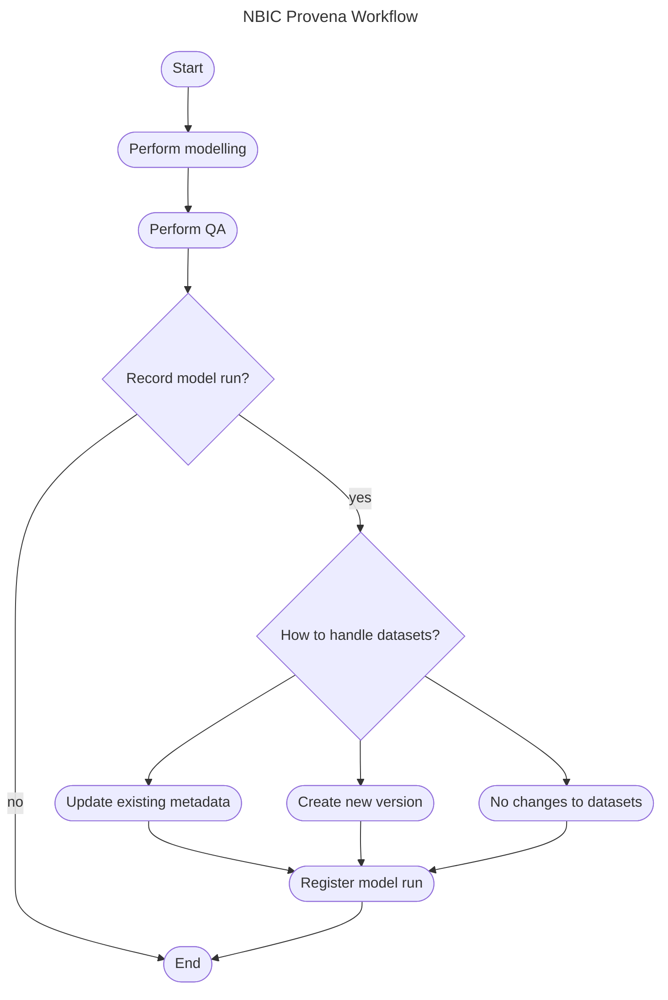

# NBIC <-> Provena: Workflow integration strategy

This document will describe

- some key provena concepts for registering datasets and provenance
- key concepts for NBIC workflows
- how these concepts align
- how we could register data and provenance, including some diagrams and key
  decision points.

## Key Provena Concepts

Provena is a platform for describing and storing datasets (and optionally their
data) alongside chains of provenance which describe how the data was produced. 

Provenance is fundamentally described using PROV-O semantics, but this
complexity is hidden from the user through a custom schema of registered
entities which combine together in a 'model run' to allow for automated,
consistent PROV-O generation.

### The Registry

The Provena Registry is the main point of interaction in Provena. It stores
metadata for all types of entities, and mints persistent, resolvable identifiers
using the ARDC handle service for each entity. All entities referenced below are
registered in the Registry.

### Datasets

Datasets are a combination of metadata about a dataset, along with an
automatically provisioned secure storage location (a subfolder in a S3 bucket).
In anticipation of use cases in which data will not be stored in the provisioned
Provena S3 bucket, users can opt-out of this storage and instead **supply
reference to a storage path/location in some external repository**. Provena does
not attempt to store any information which would allow it to retrieve this data
automatically, it simply requires a URI and data access description. The user
can utilise in whatever way is convenient for their workflow.

### Model Runs

Model runs are conceptually the glue between input and output datasets. They are
an _Activity_ which executes a _Model_, triggered by a _Person_ and optionally
an _Organisation_ (see Agents below). **To register a model run, one must first
have registered all input and output datasets**. Additionally, model runs are to
be **pre-emptively described using a Model Run Workflow Template** which
characterises the expected inputs and outputs of the modelling activity through
the composition of **pre-registered dataset templates**. The reason for this
rigorous pre-emptive set up is to allow for enforcement of consistency and to
ensure a valid structure is provided to generate PROV-O automatically. 

As model runs link input and output datasets, when reflecting on the lineage of
a dataset, so long as these model runs are registered, you will see a trace of
what particular modelling activities either contributed to or entirely generated
the dataset.

### Agents

Agents are registered _Person(s)_ or _Organisation(s)_ which perform actions in
the system.

**Note**: before doing anything in Provena, the first step is to register
yourself as a _Person_ in the registry, and link your username to this _Person_,
see [linking your user to
person](https://docs.provena.io/getting-started-is/linking-identity.html).

### Templates

Templates, as described above, are reusable abstractions which describe the
shape/structure of modelling activities. **Dataset templates** are placeholders
for actual data supplied at model run time, and can optionally provide more
information about the files and resources expected to be within the dataset.
**Model run templates** are effectively compositions of dataset templates as
input and outputs. **In order to specify a dataset as an input or output of a
model run, there must be a corresponding template which acts as it's
placeholder**. 

### Models

Models are the persistent identity for a workflow, software package or other
asset which are "run" in the context of a model run. 

### Versions 

Provena provides three notable versioning mechanisms

- **Metadata history**: For all types of entities in the registry, if metadata
  is modified, a revertable history of changes is recorded. This is **always
  turned on** and is useful for **small incremental metadata changes** such as
  typo corrections, improvements etc.
- **Entity versioning**: For "Provenance Enabled" entities (Datsets, Models and
  Templates), users can optionally **trigger the creation of a new version**.
  This version is linked both in the record details and the provenance graph to
  the previous version. The new version inherits as a starting point the
  metadata of the previous version. It has a completely standalone identity and
  history, and can be referenced independently **with it's own identifier**.
  There is no relationship between the data of the previous and new version in
  S3. 
- **Data versioning**: If data is stored in the s3 location, S3 file versioning
  is enabled, meaning data can be tracked, recovered and managed using the same
  standard S3 versioning mechanisms. Provena does not inspect or consider this
  information - it is up to the user to utilise this however they desire. 

## Key NBIC Workflow Concepts

NBIC processes produce a number of datasets utilising a range of input datasets,
software models and processes. Some of the key provenance related workflow
concepts are described below.

### Datasets

NBIC datasets are critical assets which store the outputs of modelling
activities. These could be intermediary data products, or publishable output
datasets. They are typically Zarr files. These Zarr files can contain embedded
metadata in an attributes file which are programmatically accessible using
existing approaches.

### Data storage

NBIC has existing storage processes and tooling which provide the ability to
abstract away the particularities of a given storage environment/engine against
key names/identities for datasets. For example, the _hourly temperature_ dataset
could be accessed through a call (in pseudocode) such as ([source](https://bitbucket.csiro.au/projects/NBIC/repos/nbic-workflow/browse/baseline_weather_processing/hourly_FFDI.ipynb?at=BARRA-R2)):

```python
xr.open_zarr(nbic.catalog_s3_stage2.weather.baseline.BARRA.to_path('AU_R2_hourly_temperature_C.zarr'), chunks='auto')
```
Noting that the path is not directly provided, instead being redirected through
a managed listing. This storage is predominately **S3** and it utilises **S3
Object Versioning** to keep track of file level data changes, for the purposes
of understanding data history and recovering previous versions. Files are minted
file version identifiers **on a per file level** by the S3 versioning mechanism.

### Models/processes

NBIC has clearly defined modelling processes which consume input datasets,
perform processing and QA on it, then write these output(s) to downstream
datasets. An example is provided in the diagram below. This software is managed
in a central github repository.

# TODO NBIC workflow diagram here.

### Notebooks

NBIC organises and executes it's modelling and QA software processes through
Python Jupyter Notebooks. Each notebook corresponds to a model/process which are
an intermediary or terminal stage in a data modelling/processing pipeline.

#### Notebook steps

The notebooks are typically composed of these high level stages

- setup (settings, parameters etc)
- data retrieval (getting input datasets)
- data prep (performing any necessary modifications to input data)
- processing (running the process)
- result QA (assessing the quality of the result)
- metadata attribution (adding any metadata attributes to datasets)
- data writing (writing output data to the target S3 location for the specified
  product)

These steps will provide entry points for the ingestion of Provena processes to
understand this interaction.

## Provena v NBIC workflow conceptual alignment

This section will attempt to unpack some of the connections between Provena and
NBIC's modelling/provenance concepts. This will pave the way to an integration
strategy and start to highlight some critical decision points.

### Datasets

Datasets are well aligned conceptually. Datasets in Provena are discoverable,
searchable, persistent metadata objects which can optionally include data.
Datasets in NBIC are persistent ideas/artifacts which can be inputs,
intermediary products, or outputs of a processing pipeline. Datasets in NBIC are
stored at a specified path. **Each NBIC dataset could be registered as a Provena
dataset**. This registration could occur **programmatically or manually ahead of
time** depending on the position and use of the dataset in the pipeline. The
relationship between NBIC dataset versions and Provena versions is a little
blurry and is discussed in Versioning below. The way that datasets are identified between the systems is up for discussion - but initial ideas include either hardcoding a fixed ID into the notebook, or building the identity into the file metadata.

### Data Storage

Provena provides robust storage and retrieval mechanisms, but users can opt out
of this service either implicitly (by just not using it) or explicitly (by
providing an alternative data path). Either option could work in NBIC, but if
possible, **including the S3 data access path in the provena record** would be
ideal. There are no major technical issues with this approach and all features
excluding data access will work fine. This approach does introduce risk that the
dataset metadata registered is describing the wrong data (e.g. if the path
changes but it is not updated in the provena record, or vice versa). This
approach will **allow NBIC to continue using its existing access and path
mechanisms** which seems to be a path of least resistance for adoption.

### Models

Models in Provena and NBIC are well aligned. Each processing step or package in
NBIC workflows can be registered ahead of time as a persistent Model in Provena.
The source of the model can be the **the URL path to the notebook OR the workflow package/folder on git**. To
be clear: **A provena model = A NBIC model package/folder (usually one notebook)**. e.g. `weather_to_ros` is a Provena Model which refers to the `weather_to_ros.ipynb` notebook file.

I believe that for minor changes to model metadata, basic provena history will
be sufficient. For major updates, which should be captured as distinct
provenance nodes, the Model can be versioned. 

Users can supply annotations as to the particular git version of the model used
at runtime through either a) the workflow template annotation or b) a model run
annotation (or both).

### Model Runs 

In principle, **each "run" of a notebook which writes data to the output
constitutes a Provena model run**. However, there is a major decision point about which notebook runs actually get registered. This is due the frequency of testing/validation runs which either partially or completely execute the notebook. Furthermore, modified versions might temporarily exist for testing which aren't registered at all in Provena. For this reason, controlling which run(s) actually registers Provena model runs will be important.

### Templates

Templates are not clearly aligned with any NBIC concept, primarily because, so far, NBIC workflows have not been described in a provenance context. However, we can envision the following basic rules to construct a valid Provena payload and to be consistent with how outputs are being registered:

- Each high level dataset input to a NBIC notebook (e.g. hourly temps) are a **Dataset Template**
- Each high level output to an NBIC notebook (e.g. FFDI) are a **Dataset Template**
- Where the input of one process is the output of another, the **same dataset template should be used**
- Each NBIC model has a corresponding **model run workflow template** which is the composition of input and output templates as described above

This approach will necessitate either 

- the templates are registered manually as a 'bootstrapping' step and are hardcoded via their IDs into the NBIC notebook, OR
- the templates are registered manually as above, but there is sufficient information in the notebook itself to dynamically discover it's correct template, and then introspect the inputs and outputs to form a cohesive picture at runtime

In my view, the former option is a good starting point but will require some manual management. Where workflows are relatively stable, this could be a good approach without significant overhead.

This approach does not utilise the detailed dataset template functionalities in Provena (e.g. the defined and deferred resources). These features allow you to either a) declare the expectation of the existence of a resource in a dataset at model run time with a **known path** or b) require the registerer to specify a keyed resource path **at model run time**. I don't believe that NBIC will require this level of granularity for now.

### Versioning

Both NBIC and Provena have mechanisms to describe versions of datasets and models. 

NBIC manages data versions through S3 file versioning. Provena manages data versions through all three versioning mechanisms as discussed (metadata history, file versions, and Registry dataset versions).

NBIC manages model versions using Git (since models are effectively notebooks and assoc. modules). Provena manages model versions using a combination of annotations in relevant places, metadata history and Registry model versions.

This raises some questions

- what type of NBIC activity constitutes
    -  a completely new dataset
    -  a new version of a dataset (Registry versioning)
    -  updated metadata of an existing dataset (Metadata history versioning)
    -  no change to the dataset but changes to file (no versioning other than recorded model run)
- is there a relationship between file versions and provena dataset versions (whether metadata versions of Registry versions)
    - e.g. could the S3 Object identifier for a key file in the payload be supplied as an attribute on the 

## Decision points to consider

- When are datasets registered (ahead of time or on the fly)?
- How are datasets registered (manually in UI or programmatically)?
- How are models versioned? 
- When are templates created (ahead of time or on the fly)?
- How are templates created (manually in UI or programmatically)?
- What qualifies a run of a notebook for registration as a model run?
- What type of notebook run constitutes
    - A completely new dataset
    - a new version of an existing dataset
    - updated metadata for an existing dataset
    - no provena dataset changes
- How are S3 file versions related to Provena dataset versions?


## Recommended workflow

>Hard-coded setup, optional model run record, optional dataset versioning

This method will be quick to setup, and allow for a flexible approach to how you actually use Provena to record things.

The steps to use this method.

For a given notebook/model, the setup processs would be:

1. Register the model in Provena Registry (or identify existing model)
1. Identify key inputs and outputs of the model, and register datasets and datsaet templates for each
1. Compose these inputs and outputs into a model run workflow template for the notebook
1. Integrate these details into a helper library for NBIC workflows

For each time you run the notebook (workflow), the decisions would be 

1. Do I want to record this run at all?
2. If so, do I want to:
    1. Update the existing output dataset(s) metadata? or
    2. Produce a new version of the output dataset(s) and update it's metadata? or
    3. Make no change to the output dataset(s). 
3. 



## Missing pieces to implement or consider

### Attribute/metadata management

How do we determine/manage the dataset properties? There is metadata in a few places: 

- provena dataset record
- zarr attributes
- other attributes in NBIC workflows

Ideally these would be synchronised. If you run a NBIC workflow and it modifies these attributes, then there is a decision point

- new dataset version
- update existing dataset

If you create a new dataset version, then you need to update the downstream notebooks to use this updated input dataset ID. 

If you update the existing dataset, it won't be as clear in the provenance trail what has happened to justify this update or which model run caused it. You will just see a bunch of model runs which link the same inputs and outputs without any visible explanation/history.

I would recommend that:

- for very minor/incremental work, don't record the model run
- for more significant work which should be recognised as a notable run but doesn't significantly change the inputs nor outputs, update the existing dataset metadata (if necessary) and record the model run
- for significant changes (such as a change in how the data is processed, a significant input update, errors found, new releases), produce new versions of all output datasets 

### Identity management of input datasets

It would be ideal to allow, when specifying input notebook datasets, either:

- manually specify the Provena ID and WARN the user if the actual data used does not match it
- specify only the data path and WARN the user if the data at that path does not specify a Provena ID

This could be achieved as long as the Provena ID can be embedded into the dataset metadata such as the Zarr attributes. If we can achieve this, it would be a good, less error prone, method to associate the data with the current Provena dataset it is referring to. 

This would need to be considered in the overall workflow - i.e. this would only apply if the ID changes, so only when producing new dataset versions.

### S3 versioning and Provena versioning

Alessio did discuss the idea of linking the S3 file version to the provena record through an additional attribute. To justify this, there would need to be a clear utility to doing so.

One possible use case I can think of is understanding which S3 files pertain to a particular version of a dataset in provena (both at the metadata history and dataset version levels). So you could traverse the lineage of a dataset through time and then interrogate the S3 data at that point in time. 

Recording this information should not be difficult so long as we can reliably establish the _correct_ version ID from the S3 data - Alessio suggests we use the zarr attributes file as a stable file.

### Including the notebook PDF as a part of provenance

Currently, Provena does not have the ability to attach media/files alongside other annotations on a model run. Therefore, the sensible location to try and include a PDF of the notebook which generated a dataset, may be in the dataset itself. 

However, if we use the "externally reposited dataset" mode, then there is no provisioned storage location to upload the PDF. 

I can think of three solutions

1. Store the PDF somewhere else (e.g. NBIC storage) and include an annotation on the dataset which refers to this
2. Return to using Provena dataset storage, and include the NBIC data path as an annotation rather than a primary schema field - then can upload the PDF directly into provena dataset files
3. Modify Provena to allow for a storage space to exist despite the files being stored elsewhere - then upload the PDF to the provena storage
4. Modify Provena to allow the upload of documentation/files as part of metadata without using a S3 storage backend (at least from the user perspective)

The easiest would be (1), (3) would be interesting and might be the most powerful/expressive (and could even be optionally enabled as part of the dataset metadata). (2) could also be a viable solution, and would have the benefit of allowing the user of Provena to very easily access this file without having to use the NBIC S3 access mechanisms. (4) would be a fair bit of development, but could be useful. 

### Helper tools/client tools

I believe that NBIC would benefit from and may be able to contribute back, a somewhat specialised client tool which abstracts some of the complexity of these operations away. Here is an idea of a **pseudocode** workflow

```python
# imports
from ProvenaLibrary import ProvenaClient, DatasetConfiguration, RunConfiguration, Behaviour

# setup the client
client = ProvenaClient(agent="1234", organisation="1234")

# setup auth - triggers device auth flow
client.setup_auth()

# setup auth with token - no interaction needed
token = os.get_env("PROVENA_TOKEN")
client.setup_auth(token)

# read configuration file - this would include the model, templates etc
client.setup(config_file="provena_config.json")

# the client would now expect to configure the inputs and outputs

# establishing Provena ID of inputs as associated against hardcoded templates
# in the background, this reads the zarr attributes file and checks for a provena id
client.identify_input("hourly_temp", zarr_path=nbic.catalog_s3_stage2.weather.baseline.BARRA.to_path('AU_R2_hourly_temperature_C.zarr')
)

# or you could override it 
client.identify_input("hourly_temp", provena_id="1234")

# and then check the data at path is correct - throws exception if diff
client.verify_input("hourly_temp", zarr_path=nbic.catalog_s3_stage2.weather.baseline.BARRA.to_path('AU_R2_hourly_temperature_C.zarr')
)

# next you would configure intended behaviour for output dataset(s)

# firstly, establish their IDs (if not hardcoded into config)

# this would read zarr attributes for data at that location
client.identify_output("ffdi", zarr_path=nbic.catalog_s3_stage2.weather.baseline.BARRA.to_path('ffdi.zarr')
)

# or you could override it 
client.identify_output("ffdi", provena_id="1234")

# and then check the data at path is correct - throws exception if diff
client.verify_output("ffdi", zarr_path=nbic.catalog_s3_stage2.weather.baseline.BARRA.to_path('ffdi.zarr')
)


# Now determine which write behaviour you want: 

# for some - you might like to do nothing - just write over it
client.configure_output("ffdi", DatasetConfiguration(
    behaviour=Behaviour.NO_CHANGE,
))

# for others, you might update existing metadata
client.configure_output("ffdi", DatasetConfiguration(
    behaviour=Behaviour.UPDATE_EXISTING,
    metadata_updates={
    # could put changes to metadata here
    new_property: 10,
    },
))

# or maybe we want a new version and an updated metadata
client.configure_output("ffdi", DatasetConfiguration(
    behaviour=Behaviour.NEW_VERSION,
    metadata_updates={
    # could put changes to metadata here
    new_property: 10,
    },
    reason="An explanation for the new dataset version"
))

# you could then assert that it's ready to go 
client.validate_ready()

# then perform your actual modelling
# MODELLING HERE

# then perform your QA
# PERFORM QA HERE

# then, if you want to record the model run:
lodge = True
if lodge:
    result = client.lodge_run()

# then you could write your output data (including possible new provena IDs)
# WRITE DATA HERE including Provena IDs for new output versions
```
